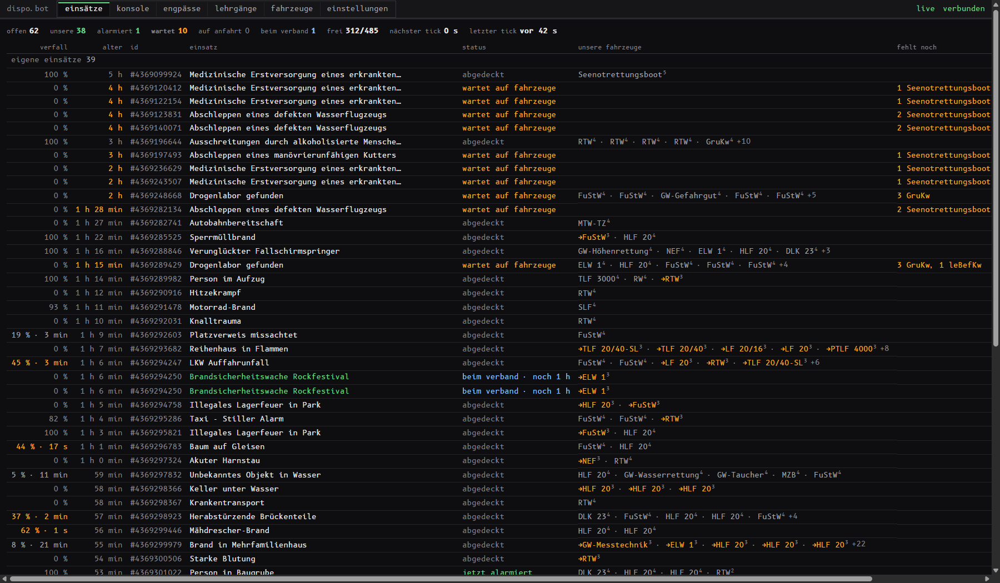
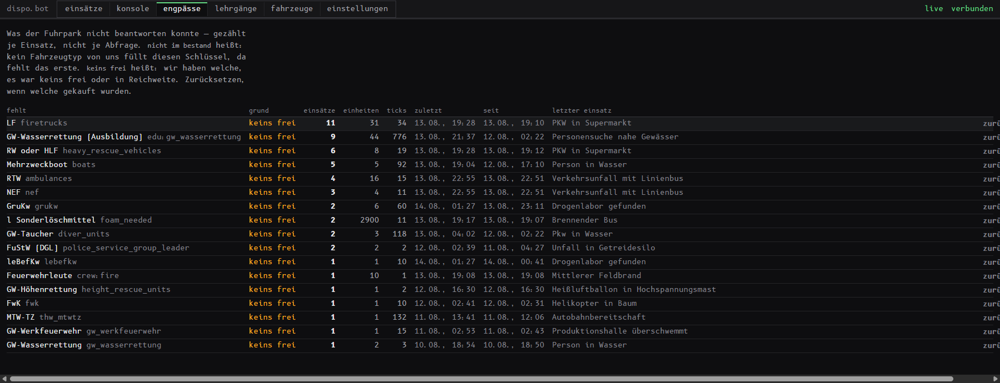
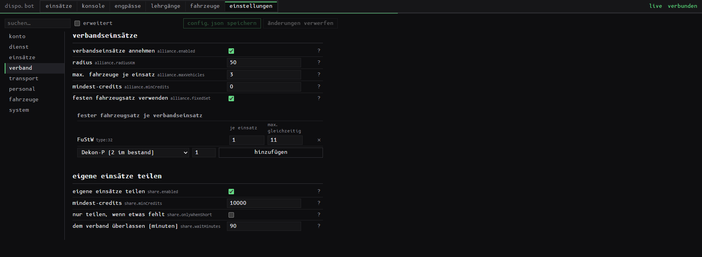
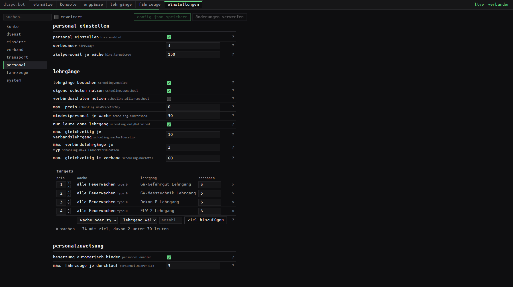

# dispo.bot

**Auto-Disponent für [leitstellenspiel.de](https://www.leitstellenspiel.de).**
Er fährt die Leitstelle, während du etwas anderes machst.

---

> ## 🚧 Noch in Entwicklung — Release folgt in Kürze!
>
> **Dieses Repository ist absichtlich noch leer.** Es gibt aktuell **keinen Download** und
> **keine Version** zum Herunterladen. Hier erscheint später ausschließlich die fertige
> `dispo.exe` unter *Releases* — der Quellcode bleibt privat.
>
> Wer Bescheid wissen will, wenn es losgeht: oben rechts auf **Watch → Custom → Releases**,
> dann gibt GitHub Bescheid, sobald die erste Version da ist.

---

## Was es macht

Der Bot beobachtet deine offenen Einsätze und beantwortet sie selbstständig — dauerhaft,
ohne dass jemand danebensitzt.

| | |
|---|---|
| **Alarmierung** | Erstalarm und Nachalarmierung, aus dem Fehlbestand, den das Spiel selbst meldet |
| **Patienten & Gefangene** | RTW fährt ins passende Krankenhaus, FuStW in die freie Zelle — Entfernung, Fachrichtung, freie Betten, Preis |
| **Verbandseinsätze** | Einsätze der Partner mitfahren, mit eigenem Radius und eigenen Obergrenzen |
| **Einsätze teilen** | Eigene Einsätze im Verband freigeben, mit Vorsprung für die Partner |
| **Personal** | Unterbesetzte Wachen werben automatisch nach |
| **Lehrgänge** | Erkennt, welcher Wache welche Ausbildung fehlt, und schickt die Leute hin |
| **Personalzuweisung** | Bindet ausgebildete Leute an die Fahrzeuge, die sie brauchen |
| **Funkrufnamen** | Neu gekaufte Fahrzeuge bekommen den Namen, den dein Schema vorgibt |
| **Engpässe** | Zählt mit, woran deine Einsätze tatsächlich scheitern — die Antwort auf „welches Fahrzeug kaufe ich als nächstes" |
| **Dienstplan** | Feste Dienstzeiten, mehrere Spielaccounts, Umschalten im laufenden Betrieb |

## Das Bedienpanel

Läuft lokal auf `http://127.0.0.1:8787`, komplett auf Deutsch. Kein Cloud-Dienst, kein
Account, keine externe Verbindung — die Seite funktioniert auch offline.

**Einsätze** — älteste zuerst. Wertverfall, Alter, Status, welche eigenen Fahrzeuge drauf
sind und was noch fehlt. Eigene Einsätze und Verbandseinsätze getrennt.

**Engpässe** — woran die Einsätze wirklich scheitern, gezählt je Einsatz statt je Abfrage.
`nicht im bestand` heißt: dieses Fahrzeug fehlt komplett. `keins frei` heißt: zu wenige.
Das ist die Antwort auf „was kaufe ich als nächstes".

**Verband** — Radius, Fahrzeuge je Einsatz, fester Fahrzeugsatz mit Obergrenze, und wann
eigene Einsätze im Verband geteilt werden.

**Personal & Lehrgänge** — Zielpersonal je Wache, welche Ausbildung welche Wache braucht,
in welcher Reihenfolge, und ab wann eine Wache zu dünn besetzt ist, um jemanden abzugeben.

Dazu eine Konsole, in der jede Entscheidung mitlesbar ist: was alarmiert wurde, was noch
wartet und woran es fehlt.

## Was ihn unterscheidet

- **Er liest den echten Fehlbestand des Spiels**, nicht eine feste Vorlage. Damit zählen
  auch die Fahrzeuge der Verbandspartner mit, die deine eigene Fahrzeugliste gar nicht sieht.
- **Kein Raten.** Ein Fahrzeugtyp ohne hinterlegte Zuordnung wird gemeldet, nicht auf
  Verdacht losgeschickt.
- **Sparsam.** Zwei Anfragen pro Durchlauf, egal wie viele Einsätze offen sind.
- **Unauffällig.** Zufällige Abstände zwischen den Durchläufen, zufällige Reihenfolge beim
  Alarmieren, und außerhalb der eingestellten Dienstzeit passiert gar nichts.
- **Deine Daten bleiben bei dir.** Die Zugangsdaten liegen verschlüsselt auf deinem Rechner,
  und der gesamte Spielverkehr läuft über deine eigene IP-Adresse.

## Systemvoraussetzungen

- Windows 10/11, 64 Bit
- Kein Node.js, keine Installation, keine Adminrechte — eine `.exe` und vier Textdateien
- Rund 90 MB Speicherplatz

## Lizenz

Der Bot braucht einen Lizenzschlüssel; eingetragen wird er direkt im Panel. Ein Schlüssel
läuft ab der ersten Aktivierung und gilt für **eine laufende Installation** — beliebig viele
Spielaccounts, aber nicht zwei Rechner gleichzeitig.

Schlüssel gibt es über Discord.

## Support & Kontakt

Discord: <!-- TODO: Einladungslink eintragen -->

## Hinweise

Dieses Projekt steht in keiner Verbindung zu leitstellenspiel.de oder deren Betreibern.
Die Nutzung von Automatisierung kann gegen die Spielregeln verstoßen — die Entscheidung und
das Risiko liegen bei dir.
