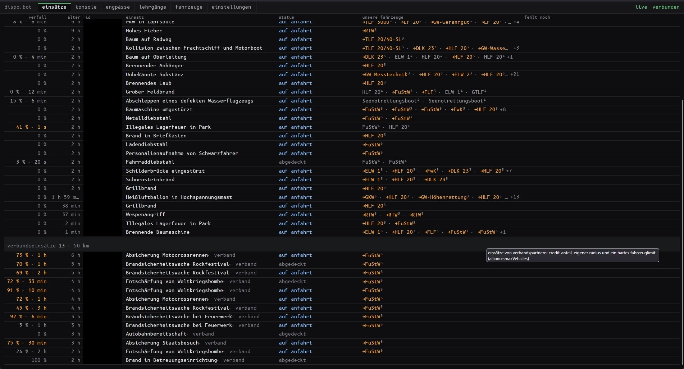
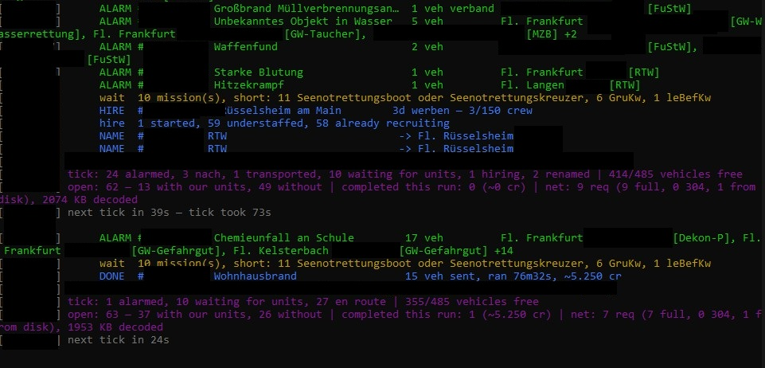
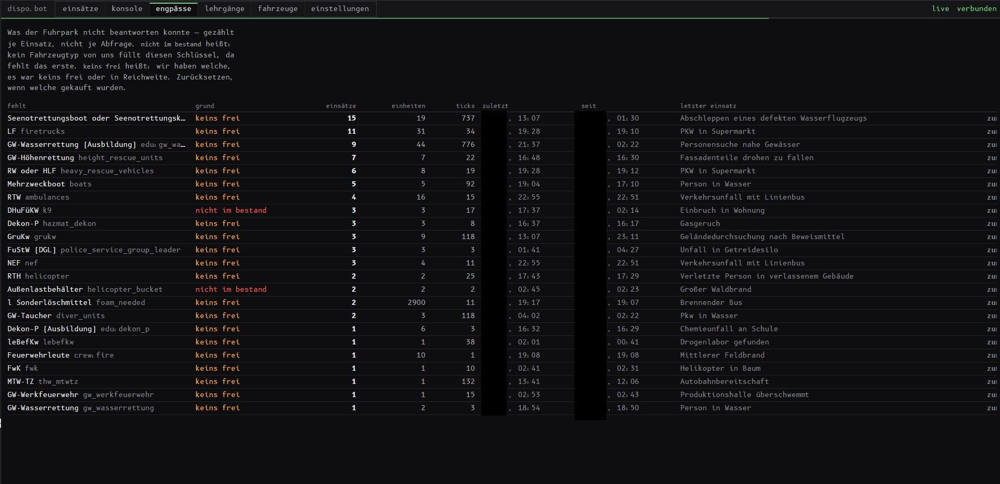
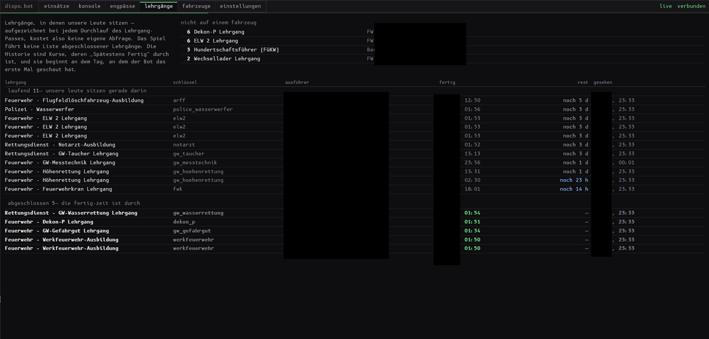
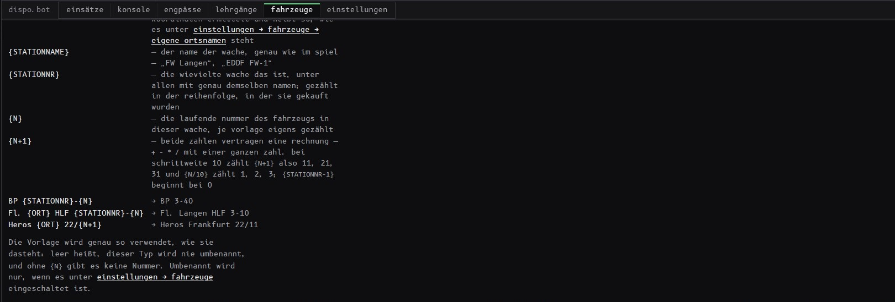
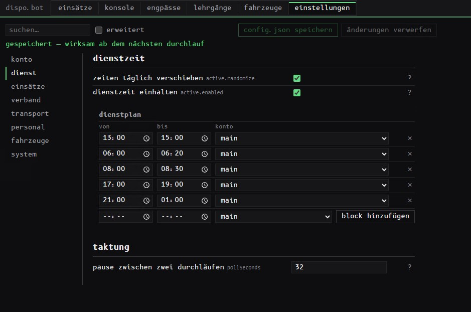
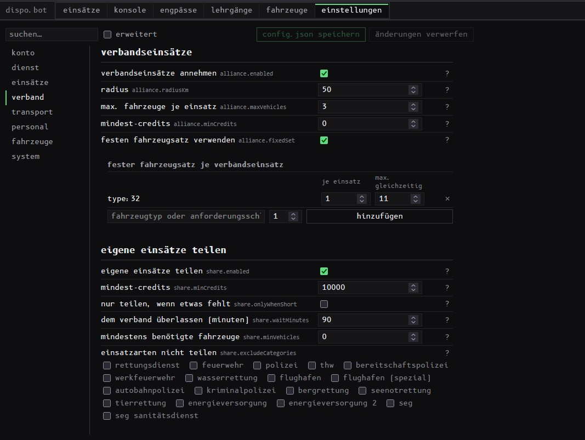
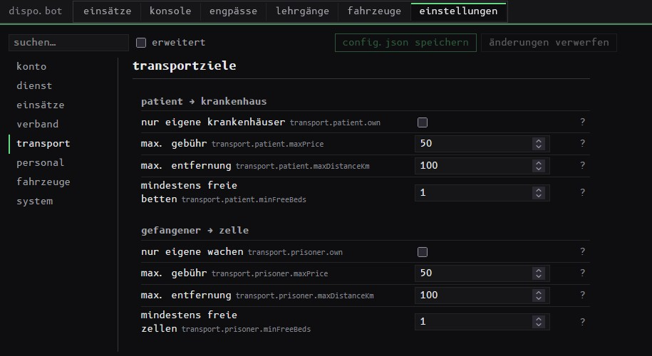
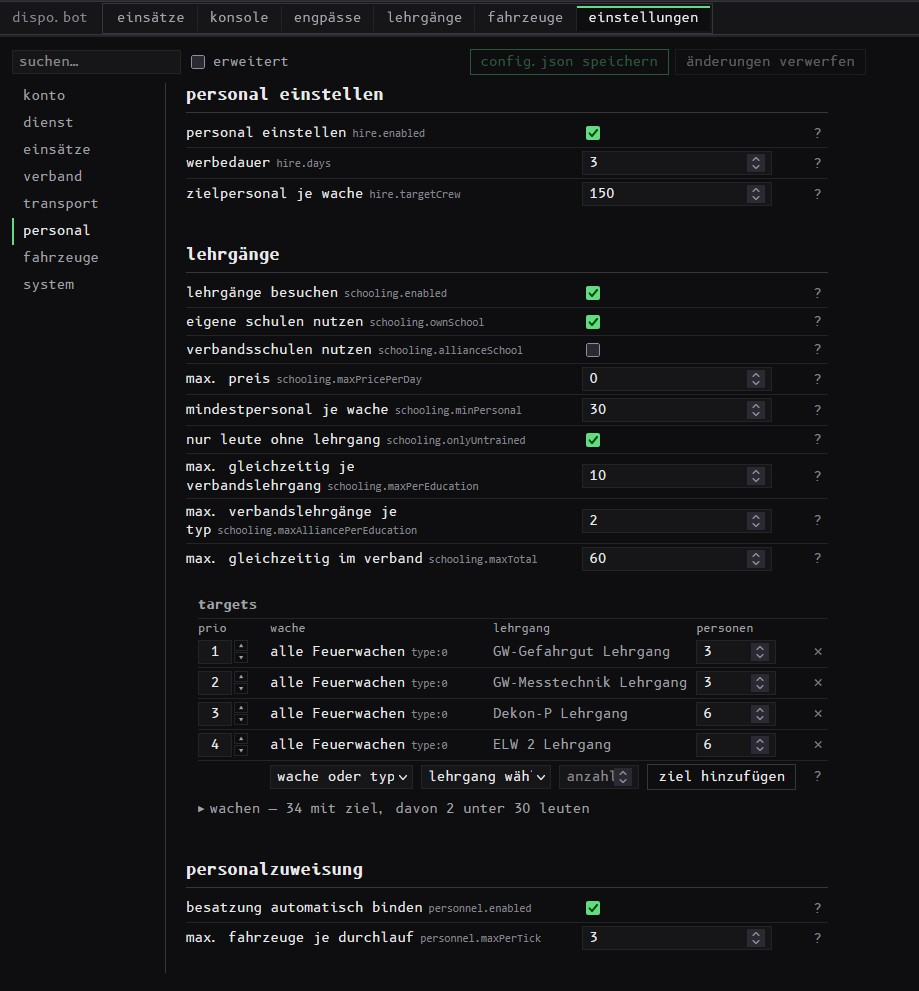
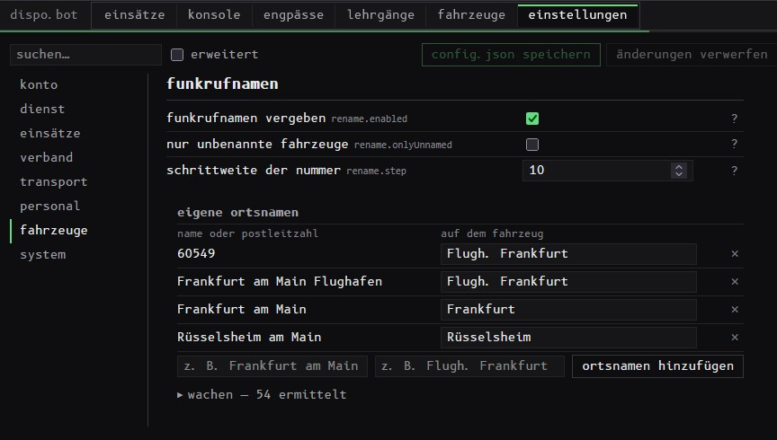

# dispo.bot

**Auto-Disponent für [leitstellenspiel.de](https://www.leitstellenspiel.de).**
Er fährt die Leitstelle, während du etwas anderes machst.

---

> ## 🚧 Noch in Entwicklung — Release folgt in Kürze!
>
> **Dieses Repository ist absichtlich noch leer.** Es gibt aktuell **keinen Download** und
> **keine Version** zum Herunterladen. Hier erscheint später ausschließlich die fertige
> `dispo.exe` unter *Releases* — der Quellcode bleibt privat.
>
> Wer Bescheid wissen will, wenn es losgeht: oben rechts auf **Watch → Custom → Releases**,
> dann gibt GitHub Bescheid, sobald die erste Version da ist.

---

## Inhalt

[Was er für dich macht](#was-er-für-dich-macht) ·
[Das Bedienpanel](#das-bedienpanel) ·
[Was du einstellst](#was-du-einstellst) ·
[Warum dieser und kein anderer](#warum-dieser-und-kein-anderer) ·
[Voraussetzungen](#voraussetzungen) ·
[Loslegen](#loslegen) ·
[Vom Handy aus](#vom-handy-aus) ·
[Aktualisieren](#aktualisieren) ·
[Lizenz](#lizenz) ·
[Häufige Fragen](#häufige-fragen)

---

## Was er für dich macht

Du machst den Rechner an und gehst weg. Der Bot beantwortet die Einsätze, fährt die
Patienten ins Krankenhaus, hält deine Wachen besetzt und schickt die Leute in die
Lehrgänge, die ihnen fehlen. Wenn du abends draufschaust, siehst du auf einem Blick, was
gelaufen ist — und woran es gehakt hat.

**Alles ist einzeln abschaltbar, und ab Werk ist jede Zusatzfunktion aus.** Du entscheidest,
was er darf, und fängst mit dem an, was dir am meisten Arbeit abnimmt.

### Einsätze

| | |
|---|---|
| **Er alarmiert, was wirklich fehlt** | Nicht die Standardvorlage des Einsatztyps, sondern das, was der Einsatz *in diesem Moment* noch braucht. Hat ein Verbandspartner schon ein LF hingeschickt, schickt der Bot keins mehr — deine eigene Fahrzeugliste weiß davon nichts, der Einsatz schon |
| **Nachalarmierung bei Eskalation** | Aus einem kleinen Brand werden vier Fahrzeuge mehr: er merkt das beim nächsten Durchgang und legt nach |
| **Patienten & Gefangene** | Jeder Patient bekommt seinen RTW, sein NEF, seinen LNA oder den RTH. Jeder Gefangene einen Streifenwagen — das ist die Sorte Einsatz, die sonst die halbe Nacht offen steht, weil das Spiel von sich aus gar nicht sagt, dass ein Fahrzeug fehlt |
| **Wasser & Schaum** | Braucht ein Brand 14.800 Liter Sonderlöschmittel, fahren die großen Tanks zuerst |
| **Fehlendes Personal** | Wird aufgefüllt — und zwar so, dass dir nicht das Löschfahrzeug fehlt, wenn es zehn Minuten später brennt |
| **Kein Fahrzeug fährt doppelt** | Was schon unterwegs ist, wird abgezogen. Du wirst nie drei RTW bei einem Patienten stehen haben |

### Transport

| | |
|---|---|
| **Patient → Krankenhaus, Gefangener → Zelle** | Nach Entfernung, freien Betten bzw. Zellen und Gebühr, eigene Häuser zuerst. Die passende Fachabteilung wird bevorzugt, aber nie erzwungen: sonst sitzt der Patient bei vollen Häusern für immer im RTW |
| **Auch Boot & Hubschrauber** | Die können kein Krankenhaus anfahren, sondern übergeben an einer Rettungswache — und den Folgeeinsatz, den das Spiel daraus macht, fährt der Bot gleich mit |
| **Ist alles voll, wird freigelassen** | Ein Fahrzeug, das ewig mit einem Patienten herumsteht, kostet dich mehr als die eine Fahrt |

*Das sind genau die Automatiken, die das Spiel selbst nur mit Premium anbietet.*

### Verband

| | |
|---|---|
| **Bei den Partnern mitverdienen** | Mit eigenem Radius, eigener Untergrenze und einer Obergrenze, wie viele Fahrzeuge dabei überhaupt gebunden sein dürfen. Deine eigene Leitstelle wird davon nicht leergeräumt |
| **Fester Fahrzeugsatz** | „Zu jedem Verbandseinsatz einen FuStW, und nie mehr als elf gleichzeitig unterwegs" ist eine Einstellung, keine Fleißarbeit |
| **Teilen mit echtem Vorsprung** | Erst fährt *ein* Fahrzeug los, dann bleibt der Einsatz eine einstellbare Zeit lang liegen, damit deine Partner auch ankommen. Danach macht er ihn selbst fertig. Ohne das ist Teilen nur eine Geste |
| **Hausregeln deines Verbands** | „Nur Einsätze ab 10 benötigten Fahrzeugen freigeben" und „keine Rettungsdienst-Einsätze" hakst du an, statt dich daran zu erinnern |

### Personal

| | |
|---|---|
| **Wachen werben von selbst nach** | Unterbesetzte Wachen starten die Kampagne selbst. Kostet keine Credits, läuft nachts durch |
| **Lehrgänge, ohne Excel-Liste** | Du sagst „jede Feuerwache soll 3 Gefahrgut und 6 Dekon-P können", er sucht die passenden Kurse, schickt die Leute hin und hört auf, wenn das Ziel erreicht ist. Mit **Prioritäten**: das Wichtigste wird überall erledigt, bevor irgendwo das Zweitwichtigste anfängt |
| **Kurse werden vollgemacht** | Mit Leuten aus allen Wachen, die ihn brauchen — ein halbleerer Klassenraum blockiert genauso lange wie ein voller |
| **Die Ausgebildeten landen auf dem Fahrzeug** | Ein GW-Gefahrgut mit ungeschulter Besatzung beantwortet nichts. Er bindet die richtigen Leute fest, ohne dabei einem anderen Fahrzeug die Besatzung wegzunehmen |
| **Deine Wachen bleiben einsatzfähig** | Unter einer von dir gesetzten Mindeststärke gibt eine Wache niemanden in den Lehrgang ab |

### Nebenbei

| | |
|---|---|
| **Funkrufnamen** | Neue Fahrzeuge heißen `Fl. Langen HLF 3-10` statt `HLF 20` — nach deinem Schema, automatisch weitergezählt. Von Hand benannte bleiben, wie sie sind |
| **Engpässe** | Er merkt sich, woran deine Einsätze tatsächlich gescheitert sind. Die Antwort auf „welches Fahrzeug kaufe ich als nächstes" — aus deinen echten Einsätzen, nicht aus dem Bauchgefühl |
| **Täglicher Login** | Wird abgeholt |
| **Kein offener Spiel-Tab nötig** | Neue Einsätze entstehen nur, solange jemand danach fragt — das macht er mit |
| **Dienstplan** | Feste Dienstzeiten statt 24/7, jeden Tag um ein paar Minuten verschoben. Außerhalb ist er komplett aus und ausgeloggt |
| **Mehrere Spielaccounts** | Jeder mit eigenen Einstellungen. Umschalten per Klick oder nach Plan, ohne Neustart |

---

## Das Bedienpanel

Die ganze Bedienung ist eine Seite im Browser, auf Deutsch, auf deinem eigenen Rechner
(`http://127.0.0.1:8787`). Kein Konto, keine Anmeldung, keine Cloud. Sechs Reiter.

### einsätze — was gerade läuft

Eine Zeile je Einsatz, älteste zuerst: wie viel Wert schon verfallen ist, wie lange er
schon offen ist, was los ist, welche deiner Fahrzeuge draufsitzen und was noch fehlt.
Eigene Einsätze oben, Verbandseinsätze unten.

Bei den Fahrzeugen steht der **Typ**, nicht der Funkrufname — „BP 2-40" sagt dir nicht, ob
ein Streifenwagen oder ein Rüstwagen angerückt ist. Gelb heißt: noch auf Anfahrt. Der
Status ist ein Wort statt eines Symbols, das man erst deuten muss: *wartet auf fahrzeuge*,
*auf anfahrt*, *beim verband · noch 6 min*, *abgedeckt*. Was über eine Stunde auf Fahrzeuge
wartet, fällt farblich auf.

### konsole — warum er das gemacht hat

Jede Entscheidung mitlesbar, auch die, nichts zu tun. Am Ende jedes Durchgangs eine Zeile:
was alarmiert wurde, was noch wartet, was fertig ist, wie viele Fahrzeuge frei sind.

### engpässe — was du kaufen solltest

Der Reiter, der sich bezahlt macht. Er zählt mit, welches Fahrzeug bei deinen Einsätzen
gefehlt hat, und unterscheidet dabei zwei völlig verschiedene Probleme:

- **`nicht im bestand`** — davon hast du keines. Das erste muss her.
- **`keins frei`** — du hast welche, aber sie waren besetzt oder zu weit weg. Da hilft
  ein zweites, kein erstes.

Dazu, wie oft, seit wann und bei welchem Einsatz zuletzt. Ist das Fahrzeug gekauft, setzt
du die Zeile zurück.

### lehrgänge — was deine Leute können

Laufende Kurse mit Restlaufzeit, abgeschlossene darunter. Oben rechts die Frage, die man
sonst nirgends beantwortet bekommt: **wer ist ausgebildet und sitzt auf keinem Fahrzeug?**
Ein fertiger Lehrgang bringt nichts, solange niemand eingeteilt ist.

### fahrzeuge — dein Fuhrpark

Alle Typen mit Bestand und wie viele davon gerade frei sind. Rot markiert heißt: für diesen
Typ ist nichts hinterlegt, der wird nie alarmiert — ein Blick, und du weißt, ob dein Neukauf
tatsächlich mitspielt. Darunter, welche Anforderungen deine Flotte überhaupt abdecken kann.

Hier steht auch, wie eine Namensvorlage aufgebaut ist: die vier Bausteine, drei
durchgerechnete Beispiele, und dass eine leere Vorlage bedeutet „diesen Typ nie umbenennen".

### einstellungen

Alles, was der Bot tut, in einem Formular — mit Suche, deutscher Beschriftung und einem Satz
Erklärung hinter jedem `?`. Was man normalerweise nicht anfasst, liegt hinter dem Schalter
*erweitert*.

---

## Was du einstellst

Acht Bereiche. Das meiste stellst du einmal ein und schaust nie wieder hin.

| Bereich | Worum es geht |
|---|---|
| **konto** | Dein Spiel-Login und der Lizenzschlüssel. Mehrere Accounts, jeder mit eigenem An/Aus |
| **dienst** | Wann er arbeitet, und wie oft er nachschaut |
| **einsätze** | Wie weit deine Fahrzeuge fahren und ab welchem Wert ein Einsatz sich lohnt |
| **verband** | Mitfahren bei den Partnern, und was du selbst freigibst |
| **transport** | Wohin ein beladenes Fahrzeug fährt |
| **personal** | Anwerben, ausbilden, aufs Fahrzeug setzen |
| **fahrzeuge** | Funkrufnamen und die Ortsnamen darin |
| **system** | Port der Seite, Zugriff vom Handy |

**dienst** — der Dienstplan als Liste: von, bis, welches Konto. Mit einem Account ist das
schlicht deine Spielzeit, eine Zeile. Über Mitternacht geht. Zeiten, die kein Block abdeckt,
sind Pause — dann ist er wirklich aus. *Zeiten täglich verschieben* sorgt dafür, dass du
nicht 365 Tage lang auf die Minute genau um 07:00 online bist.

**verband** — Radius, Fahrzeuge je Einsatz, der feste Fahrzeugsatz mit Obergrenze, und wann
und was du freigibst. Die Einsatzarten, die nie in den Verband sollen, hakst du an — es
sind achtzehn, und getippt wäre eine davon irgendwann falsch geschrieben und würde still
weiter geteilt.

**transport** — vier Zahlen je Richtung: eigene Häuser oder auch fremde, was eine Fahrt
höchstens kosten darf, wie weit, und wie viele Betten bzw. Zellen frei sein müssen.

**personal** — die drei Schritte untereinander. Die Tabelle unten ist das Herzstück: je
Zeile eine Wache (oder gleich ein ganzer Wachentyp), ein Lehrgang, wie viele Leute ihn
können sollen. Die **Priorität** links entscheidet die Reihenfolge — sonst gewinnt immer
die größte Lücke, und das eine Ziel, das dir wichtig ist, kommt nie dran. Ausklappbar
darunter: auf welche Wachen eine Zeile tatsächlich zutrifft, und welche davon zu dünn
besetzt sind, um jemanden abzugeben.

**fahrzeuge** — wie der Ort im Funkrufnamen heißen soll. Links entweder ein Ortsname oder
eine **Postleitzahl**: `60549` ist der Frankfurter Flughafen, und „Frankfurt am Main" allein
unterscheidet ihn von keiner anderen Frankfurter Wache. Darunter kannst du aufklappen,
welche Wache wie erkannt wurde — das ist die Antwort auf „warum heißt das Fahrzeug so".

---

## Warum dieser und kein anderer

| | |
|---|---|
| **Echter Bedarf statt Schema F** | Den Unterschied merkst du am Monatsende: kein zweites LF zu einem Einsatz, an dem schon eines steht, keine drei RTW für einen Patienten, keine Fahrzeuge, die sinnlos gebunden sind und beim nächsten Brand fehlen |
| **Er rät nie** | Kennt er ein Fahrzeug oder eine Anforderung nicht, sagt er das — statt auf Verdacht die Drehleiter zum Gasaustritt zu schicken. Lieber einmal zu wenig als einmal falsch |
| **Er fällt nicht auf** | Unregelmäßige Abstände, wechselnde Reihenfolge, Pausen zwischen den Alarmen, und außerhalb deiner Dienstzeit passiert nichts und der Account ist ausgeloggt. Wer sechzehn Stunden am Stück online ist und im immer gleichen Takt alarmiert, fällt genau dadurch auf — und da geht es um deinen Account |
| **Schonend zu deinem Spiel** | Er lädt pro Durchgang einmal die Lage und arbeitet damit, egal ob drei oder dreißig Einsätze offen sind. Kein Dauerfeuer auf die Server, auch nicht bei viel Betrieb |
| **Deine Daten bleiben bei dir** | Deine Zugangsdaten liegen verschlüsselt auf deinem Rechner und gehen nirgendwohin. Das Spiel sieht ausschließlich deine eigene IP-Adresse — nicht die eines Rechenzentrums, hinter dem hundert andere Kunden hängen |
| **Nichts hinter deinem Rücken** | Jede Entscheidung steht in der Konsole und im Logfile, mit dem Grund daneben. Und ab Werk ist alles Zusätzliche aus: du schaltest frei, was du willst |

---

## Voraussetzungen

Kein Node.js, keine Installation, keine Adminrechte. Entpacken, doppelklicken, fertig.
Rund 90 MB Speicherplatz und ein Browser.

| | |
|---|---|
| **Windows** | 10/11, 64 Bit — `dispo.bot-win-*.zip` entpacken, `dispo.exe` doppelklicken. Beim ersten Start meldet sich eventuell SmartScreen: *Weitere Informationen* → *Trotzdem ausführen*. Das liegt an der fehlenden (teuren) Signatur, nicht am Inhalt |
| **macOS** | 11 (Big Sur) oder neuer, Apple Silicon — `dispo.bot-mac-*.zip`. macOS blockiert heruntergeladene Programme; im Paket liegt eine `LIESMICH-mac.txt` mit dem einen Befehl, der das aufhebt. Für einen älteren Intel-Mac im Discord fragen |

---

## Loslegen

1. **Herunterladen** — das Paket für dein System, unter *Releases*.
2. **Entpacken und starten** — in einen eigenen Ordner, dann `dispo.exe` doppelklicken
   (macOS: `./dispo`).
3. **Panel öffnen** — im Fenster steht nach ein paar Sekunden eine Adresse wie
   `http://127.0.0.1:8787`. Die im Browser aufmachen.
4. **Lizenz eintragen** unter *einstellungen → konto*, dann *aktivieren*.
   **Ab diesem Klick läuft deine Laufzeit, nicht ab dem Kauf** — ein Schlüssel kann also
   liegen bleiben, ohne einen Tag zu verlieren.
5. **Login und Dienstzeit setzen**, danach in Ruhe durchgehen, was er noch übernehmen soll.
   Jede Einstellung erklärt sich hinter ihrem `?`.

---

## Vom Handy aus

Die Seite hat kein Passwort und ist deshalb erst mal nur auf deinem eigenen Rechner
erreichbar. Wenn du sie unterwegs sehen willst: **[Tailscale](https://tailscale.com)** auf
beiden Geräten installieren, gleiches Konto, fertig. Der Bot findet die Adresse selbst und
schreibt sie beim Start hin.

Alles andere lehnt er ab, und zwar absichtlich: auf dieser Seite stehen deine Zugangsdaten,
die gehört nicht ins offene Internet.

Auf dem Telefon wird aus jeder Tabellenzeile ein lesbarer Block, und alle sechs Reiter sind
gleichzeitig sichtbar.

---

## Aktualisieren

Neues Paket herunterladen und **über den vorhandenen Ordner entpacken**, alles überschreiben
lassen. Deine Einstellungen, deine Zugangsdaten, deine Lizenz und deine Funkrufnamen bleiben
— die sind gar nicht erst im Paket drin. Neue Fahrzeugtypen kommen beim nächsten Start von
selbst dazu.

Was sich geändert hat, steht im Discord.

---

## Lizenz

Der Bot braucht einen Schlüssel, den du direkt im Panel einträgst. Er läuft **ab der ersten
Aktivierung** und gilt für **eine laufende Installation** — beliebig viele Spielaccounts,
aber nicht zwei Rechner gleichzeitig.

Schlüssel gibt es über Discord.

---

## Häufige Fragen

**Muss ein Spiel-Tab offen bleiben?**
Nein. Er sorgt selbst dafür, dass neue Einsätze entstehen — ohne das füllt sich die Karte
gar nicht, egal wer zuschaut.

**Muss mein Rechner durchlaufen?**
Nur, solange er spielen soll. Mit Dienstplan arbeitet er in deinen Zeiten und ist sonst aus.

**Was, wenn er abstürzt?**
Er startet sich 30 Sekunden später von selbst neu und macht da weiter, wo er war.

**Kann ich sehen, was er vorhat, bevor er es tut?**
Ja — die Konsole schreibt jede Entscheidung mit Begründung mit. Und alles Zusätzliche ist
ab Werk aus, du schaltest es einzeln frei.

**Braucht er Premium?**
Nein. Im Gegenteil: Transportziele automatisch wählen ist im Spiel eine Premium-Funktion,
und genau das macht er auch ohne.

**Kostet er Credits oder Coins?**
Nein. Er gibt keine Coins aus — die Sofort-Varianten beim Anwerben rührt er gar nicht erst
an. Verbandslehrgänge können Gebühren kosten; die Obergrenze dafür setzt du selbst, und mit
`0` nimmt er nur kostenlose.

**Wird mein Spielaccount gesperrt?**
Automatisierung kann gegen die Spielregeln verstoßen. Der Bot gibt sich Mühe, nicht wie
einer auszusehen — die auffälligsten Merkmale (fester Takt, starre Reihenfolge, rund um die
Uhr online) hat er alle nicht. Eine Garantie ist das nicht, und die Entscheidung liegt bei
dir.

---

## Support & Kontakt

Alles läuft über Discord: Schlüssel, Fragen, Fehler, Wünsche.

Discord: https://discord.gg/86u24ZDyAN

Bei einem Fehler hilft es sehr, wenn du die Version, was du erwartet hast, was passiert ist
und den passenden Auszug aus `logs/` gleich mitschickst. **Niemals Passwörter, Zugangsdaten
oder Screenshots mit Login posten** — auch nicht an das Team, wir fragen danach nie.

## Hinweise

Dieses Projekt steht in keiner Verbindung zu leitstellenspiel.de oder deren Betreibern.
Die Nutzung von Automatisierung kann gegen die Spielregeln verstoßen — die Entscheidung und
das Risiko liegen bei dir.
